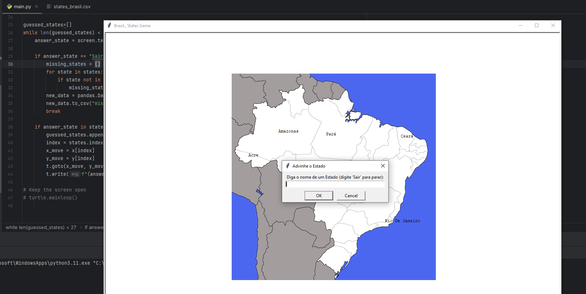

  

# Jogo: Adivinhe os Estados do Brasil

Um jogo em Python, cujo objetivo é digitar os nome de todos os estados do Brasil.

Utilizei as libraries Pandas e Turtle. Pegando as informações de nome do estado e coordenas de um arquivo csv.

# Game: Guess the States of Brazil

Description:
A Python game where the objective is to type the names of all the states in Brazil.

I used the Pandas and Turtle libraries. I retrieved the state names and coordinates from a CSV file.
